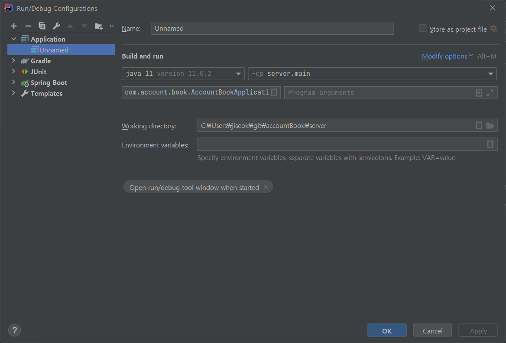
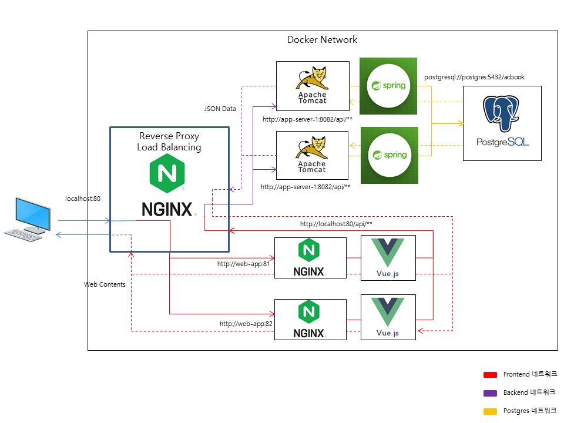

<!----
# Account Book 0.0.0

## Index

- [1. Project environments information](#1-project-environments-information)
- [2. Setting project environment](#2-setting-project-environments)
- [3. Build project](#3-build-project)
- [4. Skill Set](#4-skill-set)
---
<br />

## 1. Project environments information

|   Project Name     |             OS         |  Languege(version)  |   WAS Framework  |    Package Manager   |
|--------------------|------------------------|---------------------|------------------|----------------------|
|       server       | Ubuntu:20.04 / Windows |  Java (OpenJDK-11)  |    Spring Boot   |      Gradle(6.9)     |
|        web         | Ubuntu:20.04 / Windows |  Node.js (18.16.0)  |  Vue.js(vue cli) |        Yarn          | 

---
<br />

## 2. Setting project environments

<br />  

### 2-1. Common

> docker & docker-compose install

- Install Docker

  ```bash
  $ sudo apt update
  $ sudo apt install apt-transport-https ca-certificates curl software-properties-common
  $ curl -fsSL https://download.docker.com/linux/ubuntu/gpg | sudo apt-key add -
  $ sudo add-apt-repository "deb [arch=amd64] https://download.docker.com/linux/ubuntu $(lsb_release -cs) stable" 
  $ sudo apt update
  $ sudo apt install docker-ce
  $ sudo systemctl status docker
  # Active: active (running)
  ```
- Install Docker Compose

  ```bash
  $  sudo curl -L "https://github.com/docker/compose/releases/download/v2.5.0/docker-compose-$(uname -s)-$(uname -m)" -o /usr/local/bin/docker-compose
  $ sudo chmod +x /usr/local/bin/docker-compose
  $ docker-compose -v
  ```
- Create Postgres Container

  ```bash
  $ sudo docker-compose up -d
  ```

<br />

### 2-2. Local 

> web

- Install Node.js
  
  - Windows: [Download page (nodejs.org)](https://nodejs.org/dist/v18.16.0/node-v18.16.0-x64.msi) 
  
  - Ubuntu
  ```
    $ curl -fsSL https://deb.nodesource.com/setup_18.x | sudo -E bash -
    $ apt-get install -y nodejs
  ```

- Install yarn
  ```
  $ npm install -g yarn
  ```

- Install Vue cli
  ```
  $ npm install -g vue
  $ npm install -g @vue/cli
  
  # Windows (Admin)
  $ Set-ExecutionPolicy Unrestricted
  ```

- Initialize project

  ```
  $ cd ./web && yarn install
  ```

<br />

> server

- Install Java (OpenJDK-11)   

  - Windows: [Download Page (Oracle)](https://download.java.net/java/GA/jdk11/13/GPL/openjdk-11.0.1_windows-x64_bin.zip)
  - Ubuntu 
  ```
  $ sudo apt-get install openjdk-11-jdk  
  ```

- Install Gradle (Optional)
  
  - Windows: [Download Page (Gradle)](https://gradle.org/next-steps/?version=6.9.4&format=bin)

  - Ubuntu
  ```
  $ sdkman install gradle-6.9
  ```

> postgres

- docker-compse 

  ```bash
  $ docker-compose up -d
  ```

<br />

### 2-3. Docker Development

#### **🚨 Improtant 🚨**

**In the Docker environment, Vue hot reload works only on the Linux operating system. If running on Windows, please install and use docker-compse on WSL Ubuntu or other Linux operating systems.**

> Init 

- docker-compose

  ```bash
  $ sudo ./docker-compose-dev up -d
  ```

> Rebuild project
  
- docker-compose 

  ```bash
  $ sudo ./docker-compose-dev restart
  ```

--- 

<br />

## 3. Build project

> Build docker container 

- docker-compose 

  ```bash
  $ sudo ./docker-compose-prd up -d
  ```


<br />

## 4. Skill Set

> server

- Spring book framework  
  - WAS(Web Application Server)

- Spring web soket
  - Pair Message Alarm (Web Socket)

- Mybatis
  - ORM 

- JWT
  - Authentication, Authorization

- Lombok
  - Java code diet library

- Junit
  - Java unit test

> web


- Node.js + Typescript
  - Web language

- Vue.js
  - UI Interface framework

- Yarn
  - Node.js package manager
  
- Vuex 
  - Magnagement state + pattern library 

- Vuetify
  - UI component Framework

- Axios
  - Promise based HTTP client

- Web socket client
  - web socket client
  
- Nginx
  - load-balancer, reverse-proxy


-->

# Account Book 0.0.0 (Korean)

## 목차

- [1. 프로젝트 환경](#1-프로젝트-환경)
- [2. 프로젝트 환경 구성](#2-프로젝트-환경-구성)
- [3. 프로젝트 빌드](#3-프로젝트-빌드)
- [4. 프로젝트 기술 스택](#4-프로젝트-기술-스택)

--- 
<br />

## **1. 프로젝트 환경**

⚠️**프로젝트 환경을 독립적으로 구성하기 위해 **Linux(Ubuntu) Docker** 환경을 구성하는것을 권장합니다.**

|   프로젝트 이름     |             운영체제         |  언어(버전)  |    프레임워크  |    패키지 매니져   |
|--------------------|------------------------|---------------------|------------------|----------------------|
|       server       | Ubuntu:20.04 / Windows |  Java (OpenJDK-11)  |    Spring Boot   |      Gradle(6.9)     |
|        web         | Ubuntu:20.04 / Windows |  Node.js (18.16.0)  |  Vue.js(vue cli) |        Yarn          | 

---
<br />

## **2. 프로젝트 환경 구성**

### 2-1. 공통 환경 구성

> docker & docker-compose 설치

🚨 **로컬 설치도 도커를 통해 DBMS (PostgreSQL)를 구성하기 때문에 Docker와 Dockcer compose를 설치하여야 합니다.** 

- 도커 설치

  ```bash
  $ sudo apt update
  $ sudo apt install apt-transport-https ca-certificates curl software-properties-common
  $ curl -fsSL https://download.docker.com/linux/ubuntu/gpg | sudo apt-key add -
  $ sudo add-apt-repository "deb [arch=amd64] https://download.docker.com/linux/ubuntu $(lsb_release -cs) stable" 
  $ sudo apt update
  $ sudo apt install docker-ce
  $ sudo systemctl status docker
  # Active: active (running)
  ```
- docker-compose 설치

  ```bash
  $  sudo curl -L "https://github.com/docker/compose/releases/download/v2.5.0/docker-compose-$(uname -s)-$(uname -m)" -o /usr/local/bin/docker-compose
  $ sudo chmod +x /usr/local/bin/docker-compose
  $ docker-compose -v
  ```
- 도커 컨테이너 실행 명령어 **(PostgreSQL Container만 실행)**

  ```bash
  $ sudo docker-compose up -d
  ```

<br />

---
⚠️**개발 환경은 [로컬 환경](#2-2-로컬-환경-구성-로컬-pc에-프론트엔드--백엔드-환경-구성) 또는 [도커 개발 환경](#2-3-도커-개발-환경-구성) 구성 중 택하여 구성하시면 됩니다.**

### 2-2. 로컬 환경 구성 (로컬 PC에 프론트엔드 & 백엔드 환경 구성)

> web

- Node.js 설치
  
  - 윈도우: [Download page (nodejs.org)](https://nodejs.org/dist/v18.16.0/node-v18.16.0-x64.msi) 
  
  - 우분투
  ```
    $ curl -fsSL https://deb.nodesource.com/setup_18.x | sudo -E bash -
    $ apt-get install -y nodejs
  ```

**아래는 윈도우 & 우분투 공통입니다.**

- yarn 설치
  ```
  $ npm install -g yarn
  ```

- Vue cli 설치
  ```
  $ npm install -g vue
  $ npm install -g @vue/cli
  
  # Windows (Admin)
  $ Set-ExecutionPolicy Unrestricted
  ```

- Initialize project

  ```
  $ cd ./web && yarn install
  ```

<br />

> server

- Java (OpenJDK-11) 설치   

  - Windows: [Download Page (Oracle)](https://download.java.net/java/GA/jdk11/13/GPL/openjdk-11.0.1_windows-x64_bin.zip)
  - Ubuntu 
  ```
  $ sudo apt-get install openjdk-11-jdk  
  ```

- Intellij 구성

  
  


- Gradle 설치 **(필수 아님)**
  
  - Windows: [Download Page (Gradle)](https://gradle.org/next-steps/?version=6.9.4&format=bin)

  - Ubuntu
  ```
  $ sdkman install gradle-6.9
  ```

> postgres

- docker-compose

  ```bash
  $ docker-compose up -d
  ```


<br />

### 2-3. 도커 개발 환경 구성

#### **🚨 중요 🚨**

**윈도우 Docker Desktop 환경에서는 Vue Cli의 Hot reload 기능이 동작하지 않기 때문에 윈도우로 실행시키고자 한다면 WSL Ubuntu를 설치하여 개발 환경구성을 해주시기 바랍니다.**

> 초기 설정

- docker-compose

  ```bash
  $ sudo ./docker-compose-dev up -d
  ```

> 프로젝트 재빌드
  
- docker-compose 

  ```bash
  $ sudo ./docker-compose-dev restart
  ```

--- 

<br />

## **3. 프로젝트 빌드**

> 도커 컨테이너 빌드 

- docker-compose 

  ```bash
  $ sudo ./docker-compose-prd up -d
  ```

> 빌드 환경 네트워크 구성도

- 네트워크 구성도

  

<br />


## **4. 프로젝트 기술 스택**

> server

- Spring book framework  
  - 백엔드 서버 프레임워크 

- Spring web soket
  - 페어 메세지 웹소켓 전송

- Mybatis
  - Java ORM 기술 

- JWT
  - 로그인 인증 및 인가

- Lombok
  - Java 코드 다이어트 라이브러리 (Getter, Setter 및 생성자 등 자동생성)

- Junit
  - Java 단위 테스트 라이브러리

> web


- Node.js + Typescript
  - 프론트엔드 언어

- Vue.js
  - UI 인터페이스 프레임워크

- Yarn
  - Node.js 패키지 매니저
  
- Vuex 
  - 상태 영속성 및 패턴 관리 라이브러리 

- Vuetify
  - UI 컴포넌트 프레임워크

- Axios
  - Promise 기반 HTTP 클라이언트

- Web socket
  - 페어 메시지 전송용 web socket 클라이언트

> 기타 

- Nginx
  - 로드 밸런서 및 리버스 프록시 구성

- Jenkins
  - 빌드 및 배포 파이브라인 구성